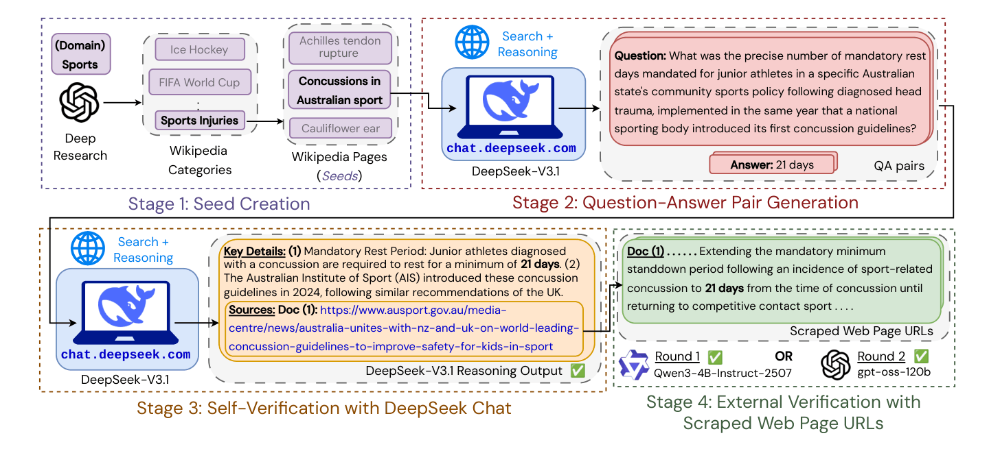

# ORBIT

<p align="center">
  <picture>
    <source media="(prefers-color-scheme: dark)" srcset="assets/orbit-with-name-logo.png">
    
  </picture>
</p>

<h3 align="center">
ORBIT: Open Web-Reasoning for Information Retrieval Tasks
</h3>

<p align="center">
|
<a href="https://arxiv.org/abs/2604.01195"><b>Paper</b></a> |
<a href="https://huggingface.co/orbit-ai/orbit-4b-v0.1"><b>Model</b></a> |
<a href="https://huggingface.co/datasets/orbit-ai/orbit-20k"><b>Dataset</b></a> |
<a href="data/README.md"><b>Data Pipeline</b></a> |
<a href="models/train/README.md"><b>Training</b></a> |
<a href="models/eval/README.md"><b>Evaluation</b></a> |
</p>

<p align="center">
  <a href="https://arxiv.org/abs/2604.01195">
    
  </a>
  <a href="https://github.com/castorini/orbit/stargazers">
    
  </a>
  <a href="https://huggingface.co/orbit-ai/orbit-4b-v0.1">
    
  </a>
  <a href="https://huggingface.co/datasets/orbit-ai/orbit-20k">
    
  </a>
  <a href="https://github.com/castorini/orbit/blob/main/LICENSE">
    
  </a>
  
</p>

---

<p align="center">
  
</p>

---

## Features

- 🌐 **4-round data pipeline** — turns raw Wikipedia seeds into a verified multi-hop QA dataset through generation, self-verification, and external judging
- 💸 **Zero API spend** — Zero dollars spent on expensive Web Search APIs or search-enabled LLMs; the entire pipeline runs on Selenium + DeepSeek Chat and uses search aggregators such as DDGS
- 🤖 **GRPO training with web search** — trains search-augmented LLMs via [verl-tool](https://github.com/TIGER-AI-Lab/verl-tool) with a parallel multi-backend DDGS retrieval server
- 📊 **12-benchmark evaluation suite** — covers single-hop (NQ, TriviaQA, PopQA), multi-hop (HotpotQA, 2WikiMHQA, MuSiQue), and hard reasoning (FRAMES, GAIA, MoNaCo) benchmarks

## 📚 Contents

- 🗂️ [Data Pipeline](data/README.md)
- 🌱 [Round 1 — Seed Creation](data/round-1-seed-creation/README.md)
- ❓ [Round 2 — QA Generation](data/round-2-qa-generation/README.md)
- ✅ [Round 3 — Self-Verification](data/round-3-self-verification/README.md)
- 🏅 [Round 4 — External Verification](data/round-4-external-verification/README.md)
- 🏋️ [Model Training](models/train/README.md)
- 📐 [Data Processing](models/data_process/README.md)
- 🔎 [Evaluation](models/eval/README.md)

## Data Pipeline

ORBIT QA pairs are built through four sequential rounds. See [`data/README.md`](data/README.md) for the full overview.

| Round | What it does | Key script |
|-------|--------------|------------|
| 1 | Wikipedia category pages → seed titles | `create_seeds.py` |
| 2 | Seeds → multi-hop reasoning questions + answers | `deepseek_generate_qa.py` |
| 3 | Self-verification via DeepSeek Chat + Selenium | `deepseek_self_verify.py` |
| 4 | External verification on scraped documents via vLLM | `external_verification.py` |

<details>
<summary><b>Dataset Example</b> — TV Shows &amp; Movies domain (click to expand)</summary>
<br>

> **Question:** What was the exact runtime (minutes) of the **2017 animated feature set inside a smartphone's messaging application**, **directed by a filmmaker previously known for sequels to popular children's franchises**, **featuring a protagonist whose facial expression malfunctions**, **with voice casting that includes a lead actor from a critically acclaimed sitcom**, and **produced by a studio that later won an Oscar for Spider-Man animation**?
>
> **Answer: 86 minutes**

**Verification / Summary of Supporting Facts:**

| | Clue | Supporting Evidence |
|---|---|---|
| ✅ | **Animated Set** | *The Emoji Movie* (2017), set inside a smartphone messaging app world called Textopolis |
| ✅ | **Filmmaker** | *Tony Leondis*, previously directed sequels: *Lilo & Stitch 2*, *Kung Fu Panda: Secrets of the Masters* |
| ✅ | **Protagonist** | *Gene*, the main character in *The Emoji Movie*, struggles with malfunctioning facial expressions |
| ✅ | **Voice Cast** | *T.J. Miller*, lead actor from the HBO sitcom *Silicon Valley* |
| ✅ | **Studio** | *Sony Pictures Animation*, which later won an Oscar for *Spider-Man: Into the Spider-Verse* |

</details>


## 💾 Installation

Installing `uv` itself:
```
curl -LsSf https://astral.sh/uv/install.sh | sh
```

```bash
uv sync
source .venv/bin/activate
```

## Training/Evaluation Data

Prior to training & evaluating search agents, you should prepare the training, eval and test datasets. See [`models/data_process`](models/data_process/) for the full data processing scripts.

```bash
export HF_HOME=/u3/n3thakur/projects/cache
export HF_TOKEN=hf_...
```

*Training data* — ORBIT + NQ + HotpotQA mixed at a 1:1:1 ratio:
```bash
python models/data_process/prepare_train_data.py \
    --datasets 'nq,hotpotqa,orbit-ai/orbit-20k' \
    --local_dir models/train/data/mix-nq-hotpotqa-orbit-ratio-1-1-1 \
    --ratio 1:1:1
```

*Eval data* — all 12 validation benchmarks:
```bash
python models/data_process/prepare_eval_data.py \
    --data_sources nq,triviaqa,popqa,hotpotqa,2wikimultihopqa,musique,bamboogle,frames,gaia,monaco,webwalkerqa,webshaper \
    --local_dir models/eval/data/all-12-val-datasets
```

*Test data* — 8 Wikipedia test benchmarks:
```bash
python models/data_process/prepare_test_data.py \
    --local_dir models/eval/data/all-8-wikipedia-test-datasets
```

## Training Code

To train search agents using ORBIT, please see [models/train](models/train/).

```bash
export HF_TOKEN="hf_..."
export WANDB_API_KEY="..."

bash models/train/ddgs_web_search.sh # run ddgs web server
bash models/train/run_grpo.sh # train search agent with verl-tool
```

## Evaluation Code

To evaluate search agents trained using ORBIT, please see [models/eval](models/eval/).

```bash

bash models/eval/retrieval_server_bge.sh # run BGE index using faiss (conda env required)
bash models/eval/run_eval.sh # evaluate search agent on Wikipedia datasets
```

## Repository Structure

```
orbit/
├── data/
│   ├── round-1-seed-creation/         # Wikipedia pages → seed JSONL
│   ├── round-2-qa-generation/         # Seeds → inverted QA pairs (DeepSeek)
│   ├── round-3-self-verification/     # QA pairs → self-verified answers (DeepSeek)
│   ├── round-4-external-verification/ # Verified pairs → externally judged (vLLM)
│   └── outputs/                       # Intermediate + final JSONL files
├── models/
│   ├── train/                         # GRPO training + DDGS retrieval server
│   ├── eval/                          # BGE retrieval index + evaluation
│   └── data_process/                  # Prepare train/eval parquet files
├── pyproject.toml
└── README.md
```

## Acknowledgements

We thank the following open-source projects:
- [verl-tool](https://github.com/TIGER-AI-Lab/verl-tool) for the GRPO training framework for training search agents.
- [vLLM](https://github.com/vllm-project/vllm) for LLM inference.
- [DDGS](https://github.com/deedy5/ddgs) for a web search aggregator tool (used for search agent training with GRPO).
- [Search-R1](https://github.com/PeterGriffinJin/Search-R1) for retrieval server design inspiration and initial experiments.


## Contact

If you have any questions or suggestions, please contact us at:
- Nandan Thakur: [nandan.thakur@uwaterloo.ca](mailto:nandan.thakur@uwaterloo.ca)
- Zijian Chen: [s42chen@uwaterloo.ca](mailto:s42chen@uwaterloo.ca)
- Xueguang Ma: [x93ma@uwaterloo.ca](mailto:x93ma@uwaterloo.ca)


## Citation

If you find this data generation repository helpful, please cite our preprint work [ORBIT: Scalable and Verifiable Data Generation for Search Agents on a Tight Budget](https://arxiv.org/abs/2604.01195):

```
@misc{thakur2026orbit,
      title={ORBIT: Scalable and Verifiable Data Generation for Search Agents on a Tight Budget}, 
      author={Nandan Thakur and Zijian Chen and Xueguang Ma and Jimmy Lin},
      year={2026},
      eprint={2604.01195},
      archivePrefix={arXiv},
      primaryClass={cs.CL},
      url={https://arxiv.org/abs/2604.01195}, 
}
```
